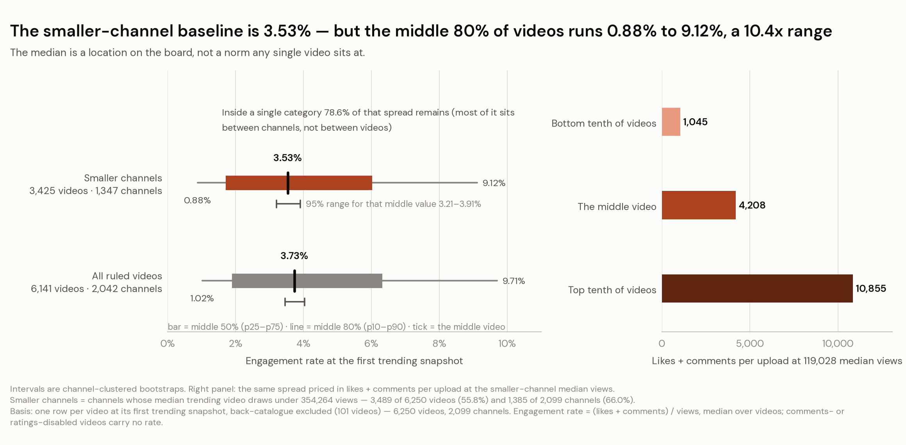
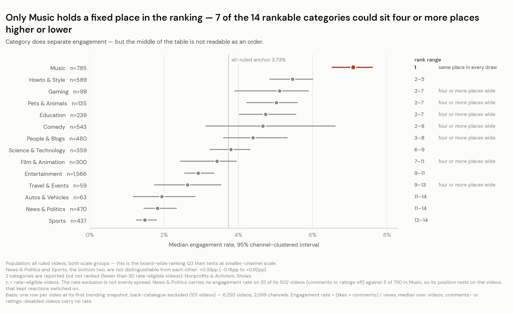
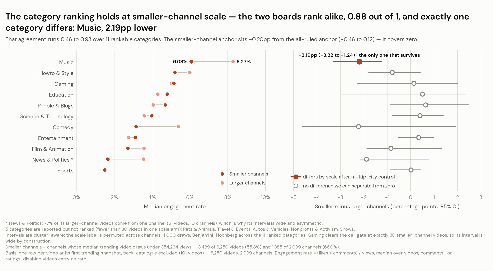
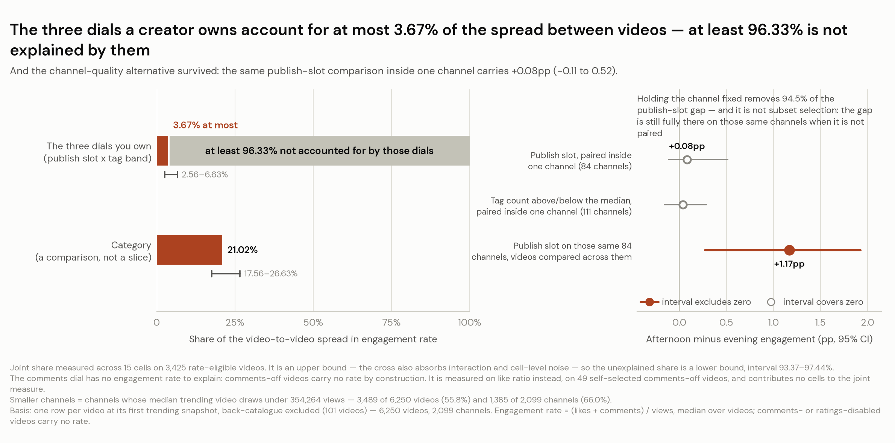
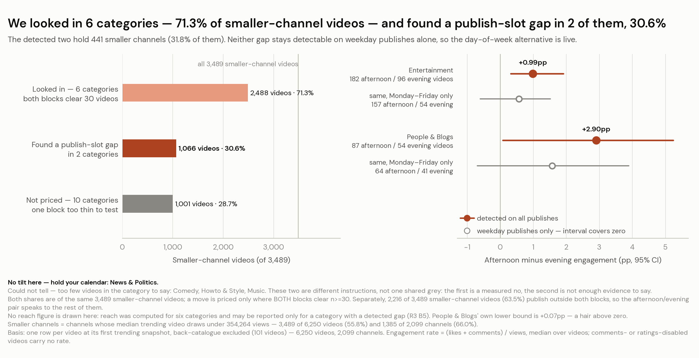
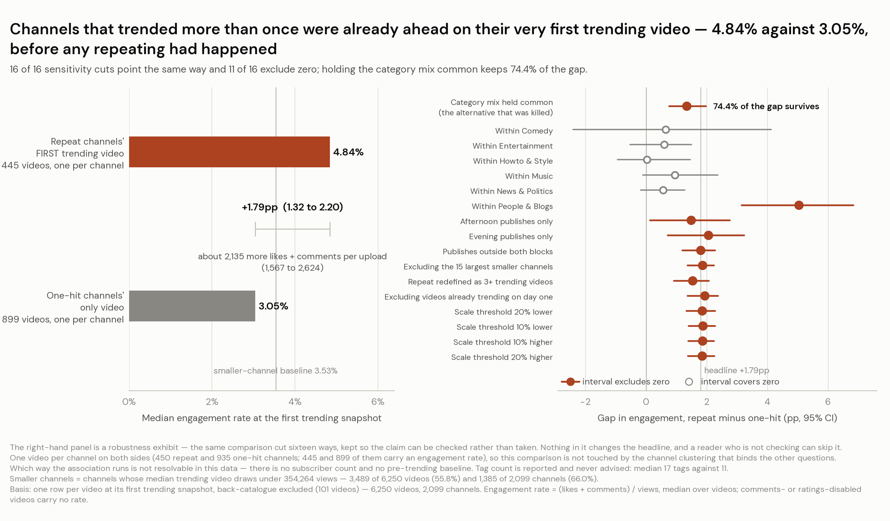

# Case Study 05 · One-hit or repeat: what separates a small channel that trends twice?

**Written for an independent creator who believes trending is luck, with a sponsor reading over
their shoulder.** 205 days of the US YouTube trending board, cut down to the channels the reader
actually competes with, to answer one question: when a small channel trends twice, what was
different about it the first time? The answer is a real and measurable difference. It is also,
honestly, not a to-do list, which is the part most write-ups of this dataset skip.

*John Amores · 2026-07-30 · Kaggle `datasnaek/youtube-new`, US slice (40,949 rows, 2017-11-14 →
2018-06-14)*

### [**Read the full interactive report →**](index.html) *(served as this repo's GitHub Page)*
### [**Open the analysis notebook →**](analysis.ipynb) *(78 cells, executed, one section per sub-question)*

On the calendar question, there were only enough videos to test six categories: Comedy,
Entertainment, Howto & Style, Music, News & Politics and People & Blogs. That is 2,488 of 3,489
smaller-channel videos (71.3%). A publish-slot gap turned up in two of them: 1,066 videos (30.6%).
For the other ten categories, 1,001 videos and 28.7% of the group, there is no priced timing move
in this study, and they get that sentence rather than a hint.

---

## The question

> **One-hit or repeat — what separates a small channel that trends twice?**

The decision behind it: the creator owns the content slate and the upload calendar, with nobody to
approve either. They wanted to know which packaging choices to copy from channels like theirs, and
they had already decided the answer was luck. So the study is built to be losable. If it were
luck, the channels that went on to trend again would have looked no different beforehand.

**Smaller channels** here means channels whose median trending video draws under 354,264 views:
3,489 of 6,250 videos (55.8%) and 1,385 of 2,099 channels (66.0%). That is most of this board, not
a corner of it. Engagement rate is likes plus comments per hundred views, taken video by video at
each video's first day on the board, reported as the middle value rather than pooled.

## Executive summary

Channels that trended more than once were already ahead on their very first trending video, before
any repeating had happened: 4.84% engagement against 3.05%, a difference of at least 1.3 and
possibly 2.2 points, measured on 445 channels against 899. At this scale a point is about 1,190
likes and comments per upload, so roughly 2,135 reactions an upload sit on the far side of that
difference: what the gap between the two groups is worth, not a gain anyone is promising. Five
things a creator owns could be tested against that comparison, and every one of them tells the two
groups apart without being a switch anyone can flip: two are at ceilings above 94%, one is
category (which this reader ruled out of scope), one is a publish slot whose effect all but
disappears once a channel is compared against itself, and the last is tag count, which does the
same. The useful consequence is a subtraction: the packaging work to stop doing, and two rules to
apply to anything anyone offers next — one of which is the only line here that earns money.

## Data structure

One table plus a category lookup. The grain is **one video on one trending day**, cumulative to
that day, so per-video statistics de-duplicate to one row per video. 6,351 unique videos across
2,198 channel strings and 205 of 213 calendar days.

| Column | Type | What it is, and what it cost to use |
|---|---|---|
| `video_id` | key | The video. Parent key is `channel_title`; there is no channel ID. |
| `trending_date` | date | `YY.DD.MM`, not ISO, so it is parsed explicitly. 8 days missing (3.76% of the span). |
| `title`, `description`, `tags` | text | `tags == '[none]'` is a sentinel on 258 videos, not a null; a default CSV read also swallows 570 blank descriptions. |
| `channel_title` | text | **Not a stable key.** 2,207 distinct strings against 2,099 ruled channels; 12 videos carry a mid-run rename. |
| `category_id` | code | 32 defined, 16 present. Needs the `US_category_id.json` lookup. |
| `publish_time` | timestamp | Stored **UTC**; converted to US Eastern, which moves 12.51% of rows to a different date. |
| `views`, `likes`, `dislikes`, `comment_count` | int | Cumulative-to-date snapshots. Nothing sums across rows. |
| `comments_disabled`, `ratings_disabled` | bool | A creator's choice, not a data fault. 107 and 32 videos; they carry no engagement rate and are reported on their own line. |
| `video_error_or_removed` | bool | 4 videos. Kept, because a removed video still trended. |
| `thumbnail_link` | url | Unused. No impression or click column exists to make it answerable. |

**Not in this file, and it matters:** no subscriber count, no watch time, no click-through, no
video duration. Every question that needed one was reframed or refused rather than estimated.

## What the analysis found

**The baseline is a location, not a norm, so a single engagement number is the wrong thing to hand
a sponsor.** A smaller channel's typical trending video draws 119,028 views and converts 3.53% of
them into a like or a comment, against 3.73% for every trending video on the board including the
giants. Being small is not the penalty most creators assume. The spread is the story: the middle
80% of videos runs 0.88% to 9.12%, a 10.4-fold range worth about 9,810 reactions an upload. Inside
a single category, 78.6% of that spread is still there, so it is not category mixing. *Next
action: quote your own median rate with its basis and where it sits in that band. Above 6.02% is
the top quarter of a board where every video already trended.*

**Category is the largest measured effect in the study, and the ranking is still not a table to
work down.** Category accounts for about 21% of the video-to-video spread among smaller channels,
roughly six times what all three owned settings account for together. Music leads at 7.09% (6.53
to 7.60) and Sports trails at 1.48% (1.26 to 1.80). But Music is the only category whose position
holds in every re-draw; 7 of the 14 rankable categories could sit four or more places higher or
lower; and the bottom two cannot be told apart. Reach is a different ranking again: the two orders
line up at only 0.37 out of 1, and with 14 categories this data cannot rule out that they are
unrelated. *Next action: judge your rate against your own category's median, not the top of the
table, and treat any two overlapping rows as unordered.*

**The giants' ranking holds at the reader's own scale, which is what makes the rest of the study
admissible.** Ranked separately, the smaller-channel and larger-channel boards line up at 0.88 out
of 1 across the 11 categories with enough videos on both sides, and the smaller-channel anchor
sits 0.20 points below the all-videos figure, a gap this data cannot separate from no gap at all.
After allowing for 11 simultaneous comparisons, exactly one category really differs by scale:
Music, 2.19 points lower on smaller channels (1.24 to 3.32 lower). It was not on anyone's list in
advance. *Next action: stop discounting board-wide evidence as somebody else's game. With the one
exception above, it is the same ranking.*

**Then the packaging playbook breaks.** Publish slot, tag count and comments-on are the three
things in this data a creator decides on every upload. Together they account for at most 3.67% of
the video-to-video spread in engagement (2.56 to 6.63), leaving at least 96.33% outside them, and
"at least" is exact, because the 3.67% is an upper bound. In countable units: of the roughly 9,810
reactions an upload separating the bottom tenth of videos from the top tenth, all three settings
account for about 161. Two of the three look real between videos, and both collapse once the
channel is held fixed: take the 84 channels that published in both blocks and compare each against
itself and the publish-slot gap falls from 1.47 points to 0.08, in a range from 0.11 lower to 0.52
higher, a 94.5% shrinkage. And it is not a thinner slice doing the work, because on those same 84 channels the
unpaired gap is fully present at 1.17 points. *Next action: stop tuning slots and tag counts; the
ceiling on what that work is worth is half a point.*

**The one move that looked like a Monday action was priced, and the reader declined it at that
price.** A move is only priced where both the afternoon block (14:00 to 18:59 ET) and the evening
block (19:00 to 23:59 ET) hold at least 30 smaller-channel videos. Entertainment's afternoon block
runs at least 0.3 points higher and possibly 1.9, costing 20.7% of the views, which is 22,491
fewer views per upload at its own base, which prices the trade at 22,797 views per point. People &
Blogs runs at least 0.1 and possibly 5.2 points higher while views run 69.1% higher too, so
nothing is traded and there is no price to judge. Two checks close it: restricted to
Monday-to-Friday publishes both gaps shrink and both ranges then cover zero, so the effect may be
about weekends rather than afternoons; and detecting a gap Entertainment's size would take about
200 uploads in each block, which at one a week is years. *Next action: if your category is one of
the ten that could not be tested, hold your calendar, and apply the same test to timing advice
from anywhere else.*

**The verdict: the two groups differed from their first appearance, and none of it is a switch.**
Each repeat channel is represented by its **first** trending video only, taken before any
repeating had happened, and matched against the one-hit channels' only video. One video per
channel on both sides, so the circular version of this comparison is not the one made. On that
footing repeat channels ran at 4.84% against 3.05%, at least 1.3 and possibly 2.2 points more, on
445 channels against 899, which is about 2,135 likes and comments an upload (1,567 to 2,624). It
survives the checks that usually kill a finding like this: hold the category mix common across
both groups and 74.4% of the gap remains; 16 of 16 sensitivity cuts point the same way and 11
exclude zero on their own; drop the 116 videos already trending on the window's opening day and
the gap widens to 1.93 points. Then the recommendation set empties on this study's own standing
rule: a true finding you cannot act on does not get to masquerade as an action. Description
presence (99.56% against 94.76%) and comments-on (98.89% against 96.79%) are ceilings with 49 and
30 videos of headroom between them. Category mix separates hardest and separates in *both*
directions, so there is not even a category to tilt toward. Publish slot's only separating level
is publishing outside both blocks, a slot never priced here. And tag count, 17 against 11, the
most concrete number in the document, does not show up when a channel is compared against itself
(0.04 points, in a range from 0.16 lower to 0.29 higher, on 111 channels). *(Associative, not
causal.)*

**Which way the arrow points cannot be settled here.** A channel may trend again because of how it
packages, or package that way because it already had an audience. Separating those needs a
subscriber count or a pre-trending baseline, and neither exists in this data at any framing. That
is a live limit carried in the report's own voice, not a footnote.
## What to do about it

The difference is systematic and it sits with the channel rather than the upload, so the honest
recommendation is a subtraction plus two rules. Three rows, not a padded list — and the first is
the only one aimed at the person paying you.

| Do this | Why | Owner | Track | Target |
|---|---|---|---|---|
| **Quote a position, not an average, when a brand asks for your engagement rate.** | On its own a rate is unplaceable. Among smaller channels the middle trending video runs 3.53% on its first board day, a quarter come in under 1.72%, and 6.02% reaches the top quarter — 3,425 videos from 1,347 channels. It needs no new upload and gives up no views, but it does need one video that has already trended: the band is drawn from first board days, so a rate measured any other way is not the one it places. | The creator | Your own median engagement rate across your trending videos, each read on its first board day — the number you hand over | Say the rate, the basis and the quarter it sits in, in one sentence. What this targets is a placeable quote, not a better deal: no fee or enquiry is in this data |
| **Stop spending effort on the five things this study tested.** | None is a switch. 94.76% of one-hit channels already write a description and 96.79% already leave comments on; tag count does not show up once a channel is compared against itself; the afternoon-evening difference is 0.08 points inside one channel against 1.47 between videos; and all three owned settings together account for about 161 reactions of a 9,810-reaction spread. | The creator | Your own median engagement rate on each video's first board day, for one quarter | Not a goal — a ceiling. Under half a point (0.52) of movement from re-slotting inside your own channel, the top of the measured range |
| **Price every trade in views given up per point of engagement gained.** | The ceiling is the reader's own, set when the study was scoped: about 25,000 views for one point. It admits everything detected here: Entertainment's afternoon block at about 22,797 views a point, People & Blogs at no price at all. At a ceiling of 20,000, that same 22,797 becomes a refusal. And one cost sits outside this data entirely: moving a publish block means finishing the edit a day earlier, every week, forever. | The creator | Views given up per point gained, on any move you make | 25,000 views per point or better; walk away above it |

**Three limits travel with that table**, and they are in the report beside it rather than in a
footnote. Every `Track` is counted on trending videos read on their first board day, so a quarter
with nothing trending has nothing to recount. A creator's own dashboard figure is a third basis
again — it counts every upload, including the ones that never trended — so it reads below anything
here and no column in this file can reconcile the two. And the quartile band is drawn over
**single videos**, so a channel with several trending videos sits nearer its middle than the
quartiles suggest.

**The biggest thing this study never priced:** 2,216 of 3,489 smaller-channel videos (63.5%)
publish in neither the afternoon nor the evening block. That majority slot is also the only
publish-slot level that told the two groups of channels apart. If one more piece of work gets
commissioned off the back of this, that is the one.

## Caveats and assumptions

- **The direction of the headline association is unresolvable here.** No subscriber count, no
  watch time, no click-through, no pre-trending baseline, no control group. This is the single
  most consequential thing the file cannot settle, and it is stated wherever the finding appears.
- **One window, one country.** 205 of 213 days between 2017-11-14 and 2018-06-14, US only. Eight
  calendar days are missing and both ends of the window are partial.
- **The headline gap is a shift between heavily overlapping distributions**, not two separated
  groups. Cliff's delta is 0.225 (0.164 to 0.288). Writing it the other way overstates it.
- **Videos from one channel are not independent draws.** The intra-channel correlation on ranked
  engagement is 0.78, so every interval outside the repeat-channel comparison is a
  channel-clustered bootstrap; a naive video-level interval is roughly three times too narrow. The
  repeat-channel comparison is exempt by construction: one video per channel on both sides, 450 of
  450 first videos verified as strictly earliest with zero ties.
- **Selection is not even.** The comments-and-ratings-off exclusion is roughly tenfold
  category-skewed (News & Politics 6.37% against Music 0.63%), and 58.7% of all excluded videos
  sit on smaller channels, the reader's own scale.
- **The detected calendar pair is finely balanced.** People & Blogs enters on a lower bound of
  0.075 points and accounts for 290 videos, 8.31% of the group; without it the detected set is
  Entertainment alone, 776 videos, 22.24%. How that behaves under a different random draw was not
  measured, and is reported as unmeasured rather than guessed.
- **Two aggregate figures are barred outright** and appear nowhere with a number: the
  all-categories-together timing figure, because the two publish blocks do not draw from the same
  mix of categories, and the everything-against-everything repeat-channel comparison, because it
  is circular.
- **All observational.** "Associated with", never "causes".

**Four asks were refused rather than answered badly:** predicting whether a video trends (every
row here already trended and no control group exists at any framing), watch time, click-through
rate and subscriber growth (the columns do not exist). What shipped instead is scoped to videos
that already trend, and the coverage statement says plainly which readers it reaches.

---

---

## What's in this repo

| Path | What it is |
|---|---|
| [`index.html`](index.html) | The interactive report, served as the GitHub Page. One self-contained file, no network dependency: charts are SVG rendered from the baked `#DATA` island and DM Sans is embedded, so it reads identically offline and with JavaScript disabled. |
| [`analysis.ipynb`](analysis.ipynb) | The notebook. 78 executed cells, 18 of them code, one expanded section per sub-question, profiling → cleaning → shaping → analysis. Built by a generator script and checked by an integrity gate that re-verifies all 16 interpolated figures against the JSON they came from. |
| [`charts/`](charts/) | The 6 PNGs embedded above, plus `chart-specs.json`. One chart authority: the report renders the same spec inline, so a PNG and its interactive twin cannot drift. |
| [`data/raw/`](data/raw/) | `US_category_id.json`, the category lookup. **The raw video table is not redistributed here** — it is a 60 MB CSV and this repo ships the report and the executed notebook rather than the pipeline, so nothing in it reads the file. To reproduce from source, fetch [Kaggle `datasnaek/youtube-new`](https://www.kaggle.com/datasets/datasnaek/youtube-new) and take the US slice: `USvideos.csv`, 40,949 rows × 16 columns, trending 2017-11-14 → 2018-06-14. |
| [`assets/fonts/`](assets/fonts/) | DM Sans TTFs, registered with matplotlib by the chart build and embedded in the report, so static charts and the interactive report share one typeface. |

**What is deliberately not here.** The pipeline internals — `scripts/`, `out/*.json`, the derived
`.parquet` tables, `findings.md`, `report.md` and the build tools — live in the working tree beside
this repo, not in it. `out/` is the source of truth every published number traces to; it is
excluded because a reader needs the report and the notebook, not the plumbing. The `.gitignore`
here enumerates exactly what stays behind.

**Method notes** live in the report's appendix and the notebook. The short version: one row per
video at its **first** trending snapshot, back-catalogue excluded (videos taking over 30 days to
reach the board, 101 videos, 1.59%); **medians of per-video rates**, never pooled sums, because
the top 1% of videos hold 19.45% of all views; **channel-clustered bootstrap intervals** everywhere
the same channel can contribute twice; **US Eastern** for every publish time; detection follows an
interval rule declared before computing, with Benjamini-Hochberg reported alongside and never used
to promote a finding.

### Key figures

| Metric | Value |
|---|---|
| Repeat channels' first trending video vs one-hit channels' only video | **4.84% vs 3.05%**, a gap of at least 1.3 and possibly 2.2 points |
| The same gap in the units a sponsor counts | **~2,135 likes + comments per upload** (1,567 to 2,624) |
| Smaller-channel baseline | **3.53% engagement on 119,028 median views** (all trending videos: 3.73% on 279,895) |
| Share of the video-to-video spread explained by the three owned settings | **at most 3.67%**, so at least 96.33% is not |
| Category, measured the same way | **21.02%** |
| Calendar coverage | looked in **2,488 of 3,489** videos (71.3%, 6 categories) · gap found in **1,066** (30.6%, 2 categories) · not priced **1,001** (28.7%, 10 categories) |
| Published in neither block, never priced | **2,216** videos (63.5%) |
| Population | 3,489 of 6,250 videos (55.8%) and 1,385 of 2,099 channels (66.0%) |

> **On the reaction range.** The 1,567–2,624 above moves with the engagement gap alone. The
> typical-views figure it converts through is itself an estimate with its own range, 104,194 to
> 132,898 views, and that width is not included. Read the reaction figures as the gap priced at a
> typical channel, not as the full spread.

> This table has no generator. It is the one place in the project where a number is
> hand-maintained. Every value above was re-checked against the source JSON on 2026-07-31, after
> the pipeline was re-run from its promoted location; re-check it again after any pipeline re-run.

Built with Python 3.14, pandas, numpy, scipy and matplotlib. No modelling library is used and none
is needed: no prediction question is in scope, because every row in this dataset already trended.
